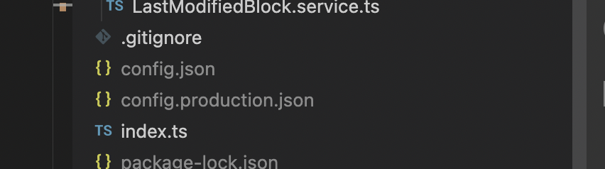
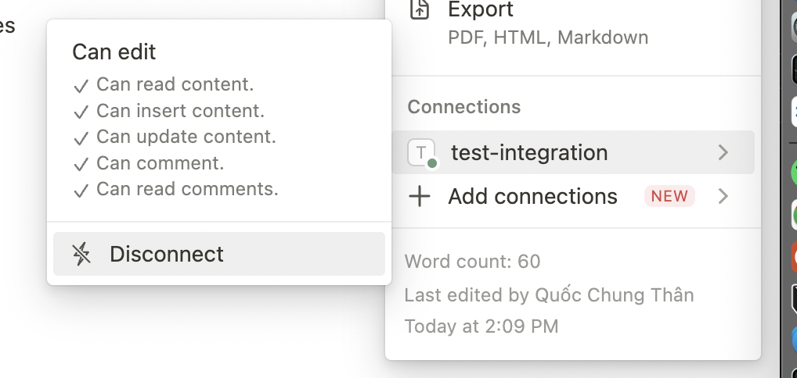

# Installation

Add config files, at least config.json file, the content should match the structure of `contract/models/Config.module.ts`:



Connect the pages to integrations:


To run:

```
npm run start
```
or 
```
npm run start:prod
```